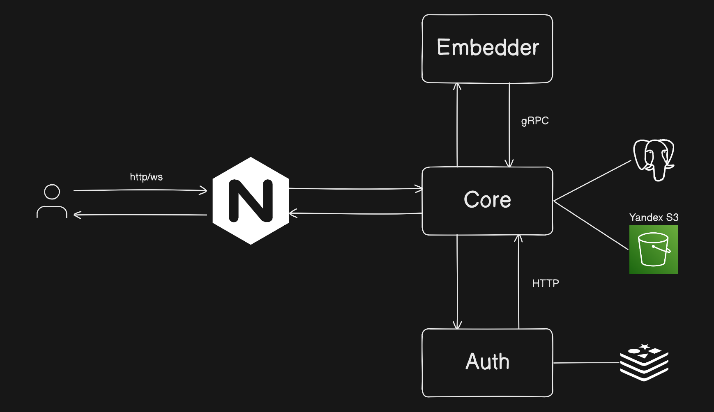
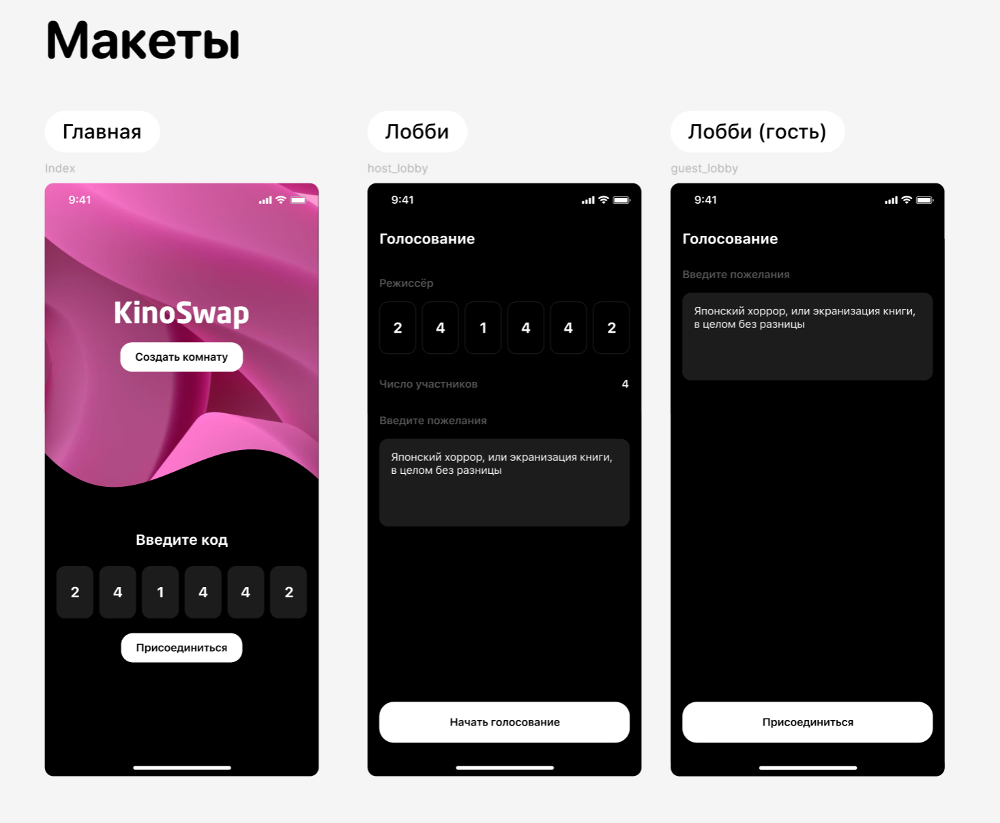
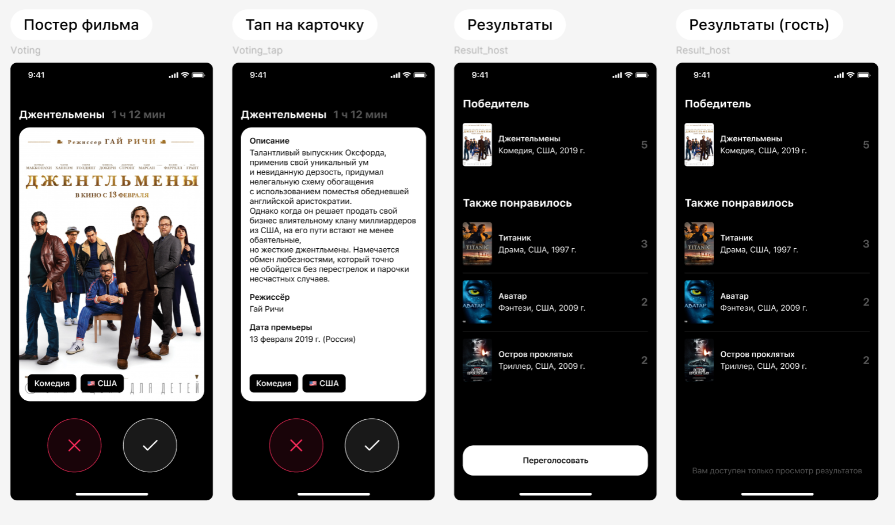

# Kinoswap

Запуск
```
make backend
```

После запуска (((можно попробовать))) перейти [сюда](http://localhost/management) :)

* В `Swagger` можно потыкать неоторые ручки, но механика голосования невозможна, так как для нее используются Web-сокеты.
* Полноценно потыкать можно через [CLI](./client/tui/)

## Архитектура 

МИКРОСЕРВИСЫ 0_Х ХАЙП!!



## Макеты


