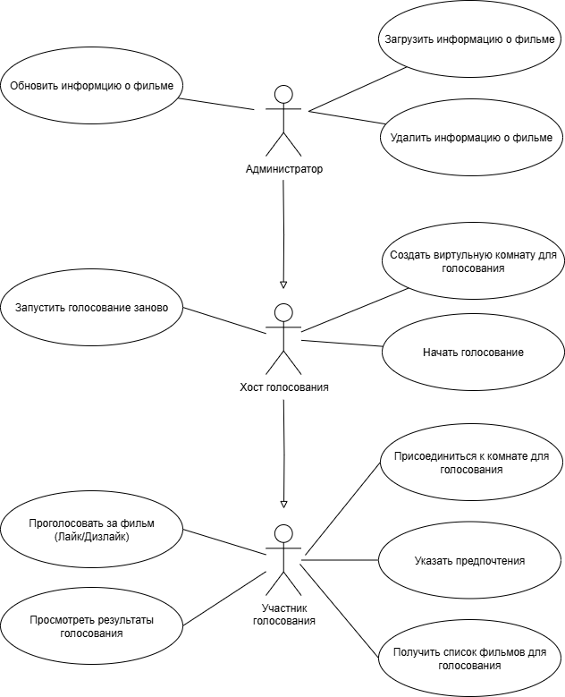
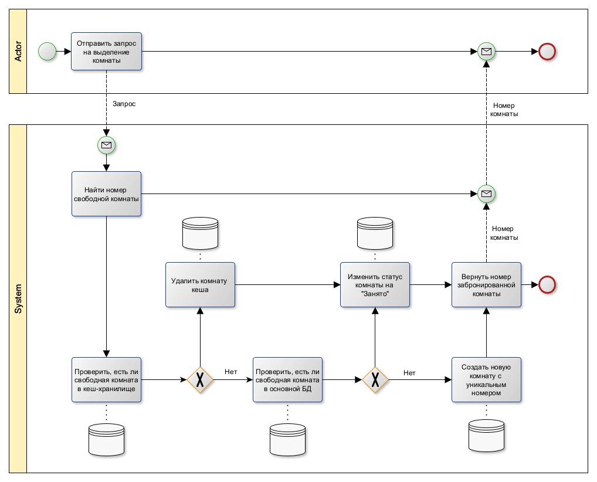
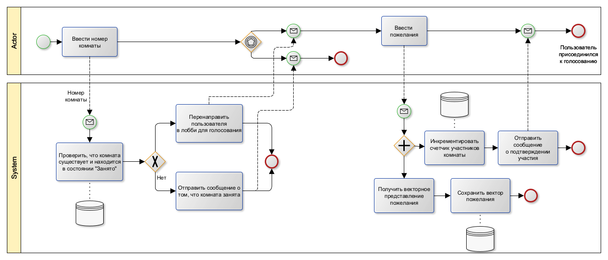
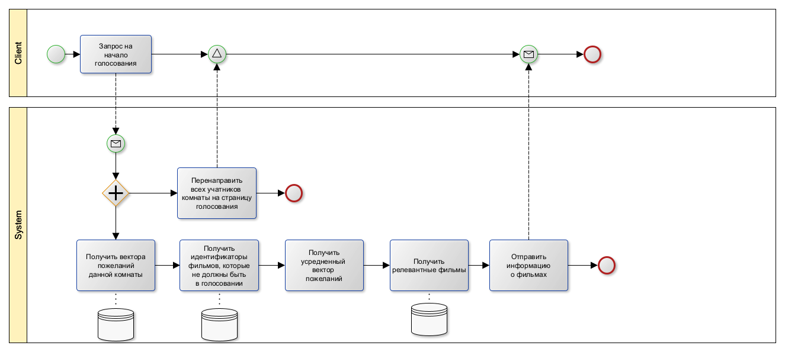
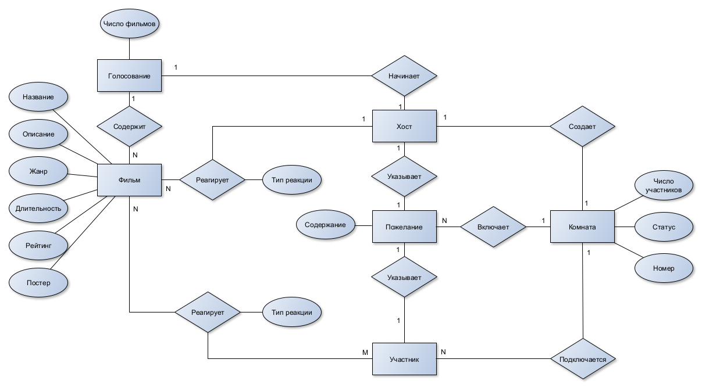
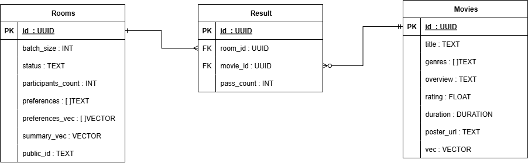
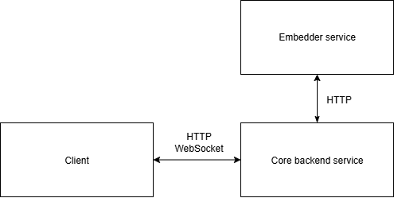
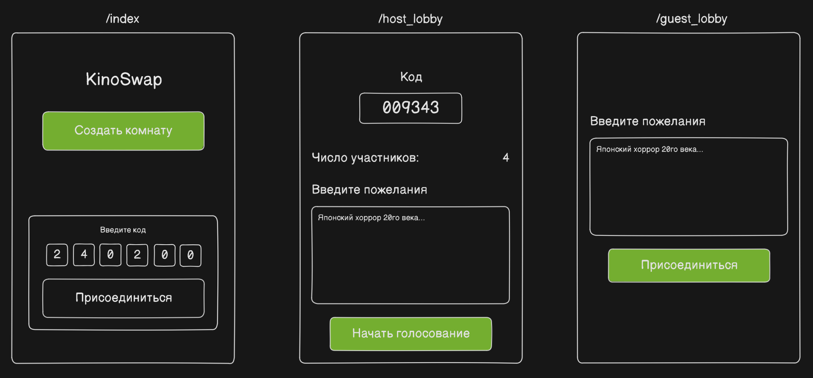
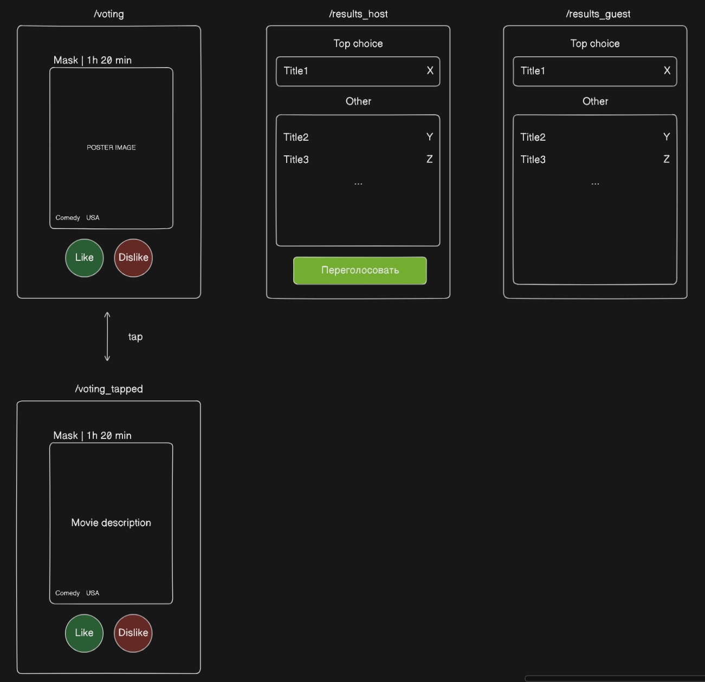

# Kinoswap - choose films together

## Цель работы

> Kinoswap - сервис для коллаборативного выбора фильмов или сериалов.

**Цель работы** - реализовать сервис для коллаборативного выбора фильмов или сериалов

Зачастую, в большой компании трудно договориться о том, что посмотреть.

Kinoswap решает эту проблему за счет следующей механики:

- Участники присоединяются к вирутуальной комнате для голосования.
- Каждый участник на свободном языке пишет свои пожелания к просмотру.
- На основе пожеланий участников комнаты из базы фильмов и сериалов формируется набор, в той или иной мере удовлетворяющий всем требованиям
- Каждый участник независимо от других пролистывает набор в "Tinder механике", ставя каждому предложенному фильму "лайк" или "дизлайк"
- После завершения голосования все предложенные фильмы ранжируются по убыванию числа лайков и показываются всем учатникам
- Если после голосования к консенсусу прийти не удалось, то можно повторить голосование с новым набором фильмов

## Функциональные требования

1. Создать виртуальную комнату
2. Присоединиться к комнате
3. Ввести свои пожелания на свободном языке
4. Просмотреть список представленных к выбору фильмов
5. Проголосовать за фильм (лайк/дизлайк)
6. Повторить голосование заново

7. ~ Добавить фильм в базу
8. ~ Удалить фильм из базы
9. ~ Обновить информацию о фильме из базы

## Usecase диаграмма

## BPMN диаграммы

### Создание виртуальной комнаты

### Принять участие в голосовании

### Формирование набора фильмов для голосования

## ER диаграмма

## Диграмма БД

## Диагрмма компонентов системы

## Технологический стек

### Backend

####

|                                           |                                                   |
| ----------------------------------------- | ------------------------------------------------- |
| Язык программирования                     | Golang (Gin HTTP Framework, Gorilla WS Framework) |
| БД для хранения текстовой мета-информации | PostgreSQL (pgvector extension for embeddings)    |
| Кеш                                       | Redis                                             |

#### Embedding service

|                       |                                                     |
| --------------------- | --------------------------------------------------- |
| Язык программирования | Python (FastAPI, HuggingFace Sentence Transformers) |

#### Frontend

|                       |                          |
| --------------------- | ------------------------ |
| Язык программирования | TypeScript (React, Vite) |

#### Доставка

Cloud.ru hosting + GitHub Actions

## Эскизы UI

